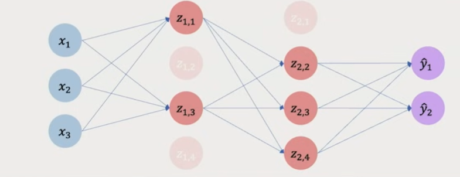
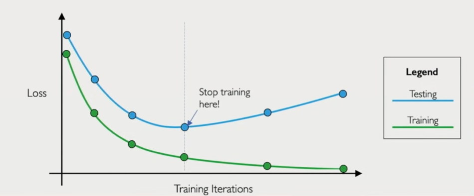

# Foundations of Deep Learning

Deep learning is built on a very simple but powerful idea: instead of manually programming rules for a machine, we let the machine learn patterns directly from data.

At the broadest level, Artificial Intelligence is about building systems that can make decisions from information. Machine Learning narrows that idea by allowing systems to learn patterns from data instead of following explicit instructions. Deep Learning goes one step further by using deep neural networks — layered mathematical models — to learn highly complex representations.

The foundation of everything begins with the perceptron.

---

## The Perceptron: The Atomic Unit

A perceptron is a mathematical function that takes inputs, multiplies them by weights, adds a bias, and passes the result through a nonlinear activation function.

Mathematically:

[
y = g(Wx + b)
]

Here:

* x = input vector
* W = weight vector
* b = bias term
* g() = activation function

The weights determine how important each input is. The bias shifts the decision boundary. The activation function introduces nonlinearity.

Without nonlinearity, stacking multiple layers would still result in a linear transformation. Real-world data is rarely linear, which is why activation functions are critical.

Common activation functions include:

* Sigmoid (useful for probabilities)
* ReLU (widely used in deep networks)

---

---

## From Single Neuron to Deep Neural Network

A single perceptron is limited in what it can represent. When we stack multiple perceptrons together, we create layers. When we stack multiple layers together, we create a deep neural network.

Each layer transforms the representation learned by the previous layer. Early layers often learn simple features. Deeper layers learn more abstract features.

For example, in image recognition:

* First layer detects edges
* Next layer detects shapes
* Next layer detects parts (eyes, nose)
* Final layer detects objects (face)

This hierarchical feature learning is what makes deep networks powerful.

---


---

## Defining the Objective: Loss Function

Training a neural network begins with a precise definition of error. A model makes predictions, but unless we quantify how wrong those predictions are, there is no signal to guide improvement. The loss function provides that signal.

Formally, a loss function maps the model’s prediction and the true label to a single scalar value that represents error. Smaller loss means better alignment between prediction and ground truth.

If we denote the model’s prediction as (y_hat) and the true label as (y), then the loss is written as:

L = L(y_hat, y)

Different tasks require different loss functions.

For classification problems where the output is categorical (for example pass/fail or cat/dog), we typically use cross-entropy loss. Cross-entropy measures the distance between two probability distributions: the predicted probability distribution and the true distribution. It strongly penalizes confident but incorrect predictions, which helps stabilize training.

For regression problems where the output is continuous (for example predicting a real-valued grade), we commonly use Mean Squared Error (MSE):

MSE = (1/N) * sum((y_hat - y)^2)

Squaring ensures the error is always positive and penalizes larger mistakes more heavily than smaller ones.

When training over an entire dataset, we compute the average loss across all samples. The entire learning process becomes an optimization problem:

Find parameters W such that L(W) is minimized.

This transforms learning into a mathematical search for the best set of weights.

---

## Optimization: Gradient Descent

We can visualize the loss function as a multidimensional landscape. Each point in this landscape corresponds to a particular configuration of weights. The height of the surface represents the loss value.

Our goal is to find the lowest valley — the configuration of weights that produces minimal loss.

We begin by initializing weights randomly. Then we iteratively update them using gradient descent.

The gradient (∇L) tells us the direction of steepest increase of the loss. To reduce loss, we move in the opposite direction.

Update rule:

W = W - eta * ∇L

Where:

* eta is the learning rate (step size)
* ∇L is the gradient (direction of steepest ascent)

The learning rate is crucial:

* Too small → convergence is extremely slow
* Too large → updates overshoot minima and training becomes unstable
* Properly tuned → stable and efficient convergence

Because neural networks often contain millions of parameters, this optimization happens in very high-dimensional space.

---

## Backpropagation

To apply gradient descent, we must compute gradients of the loss with respect to every parameter in the network. Doing this naively would be computationally infeasible.

Backpropagation solves this efficiently using the chain rule of calculus.

Training consists of two main phases.

Forward Pass:
Input data flows through the network layer by layer. Predictions are produced and the loss is computed.

Backward Pass:
The error signal is propagated backward from output to input. At each layer, we compute how much each parameter contributed to the final loss.

Because neural networks are compositions of functions, the chain rule allows us to decompose derivatives layer by layer.

Conceptually:
Output Error → Layer L → Layer L-1 → ... → Layer 1

Each weight receives a gradient indicating how changing it would change the loss.

Modern deep learning frameworks such as TensorFlow and PyTorch implement automatic differentiation, which computes these gradients automatically and efficiently.

---

## Variants of Gradient Descent

The way we compute gradients depends on how much data we use per update.

Full Batch Gradient Descent:
Uses the entire dataset to compute one gradient step.

* Stable and accurate
* Computationally expensive
* Not scalable for large datasets

Stochastic Gradient Descent (SGD):
Uses a single data sample per update.

* Very fast updates
* Noisy gradient estimates
* Can help escape shallow local minima

Mini-batch Gradient Descent:
Uses small batches (for example 32, 64, 128 samples).

* Balance between stability and speed
* Enables efficient GPU parallelization
* Most commonly used in practice

Beyond basic SGD, adaptive optimizers adjust learning rates dynamically.

Adam (Adaptive Moment Estimation):

* Maintains running averages of gradients
* Adapts learning rate per parameter
* Typically converges faster and more reliably

Other adaptive methods include RMSProp and Adagrad.

---

## Overfitting and Generalization

The true objective of deep learning is not minimizing training loss, but achieving strong performance on unseen data.

Underfitting occurs when the model is too simple to capture patterns. Both training and validation errors remain high.

Overfitting occurs when the model memorizes training data. Training loss becomes very low, but validation or test loss increases.

Ideal scenario:
Training Loss decreases.
Validation Loss decreases and remains stable.

Generalization refers to the model’s ability to perform well on new, unseen examples drawn from the same distribution.

---

## Regularization Techniques

To improve generalization and reduce overfitting, we introduce regularization.

### Dropout

During training, randomly deactivate (set to zero) a fraction of neuron activations.

Effectively, each forward pass samples a slightly different network architecture. This prevents the model from relying too heavily on specific neurons and forces distributed representations.

Dropout reduces co-adaptation between neurons and improves robustness.

---

---

### Early Stopping

We split data into training and validation sets.

During training:

* Training loss usually decreases monotonically.
* Validation loss decreases initially, then increases when overfitting begins.

We stop training at the point where validation loss is minimal. This prevents excessive memorization.

---

---

## Why Deep Learning Works Today

Neural networks have existed since the mid-20th century, but three factors unlocked their modern success.

1. Massive Data — Internet-scale datasets provide rich supervision.
2. GPU Computation — Parallel processing accelerates matrix operations.
3. Open-Source Frameworks — TensorFlow, PyTorch, and others democratize experimentation.

The underlying mathematics has not fundamentally changed. What changed is scale — data scale, compute scale, and model scale.

---

# Concept Graph: Interconnected Foundations

```
                       [AI]
                         |
                         v
                [Machine Learning]
                         |
                         v
                  [Deep Learning]
                         |
        -------------------------------------------------
        |                                               |
   [Model Architecture]                           [Optimization]
        |                                               |
   Perceptron ----> Activation ----> Deep NN     Loss Function (CE / MSE)
        |                                               |
        |                                               v
        |                                        Gradient Descent
        |                                               |
        |                                      Learning Rate (eta)
        |                                               |
        v                                               v
  Representation Learning  <------------------- Backpropagation
        |                                               |
        -------------------------------------------------
                         |
                         v
                 [Generalization]
                   /          \
           Underfitting     Overfitting
                                   |
                                   v
                          Regularization
                    (Dropout, Early Stopping)

External Enablers:
[Massive Data]  ----->
[GPU Compute]   ----->  Scaling Deep Learning
[Open Frameworks] ----->
```

This graph illustrates how architecture, optimization, and generalization interconnect, while data and compute enable large-scale success.
↓
Layer
↓
Deep Neural Network
↓
Loss Function
↓
Gradient Descent
↓
Backpropagation
↓
Mini-batch / SGD / Adam
↓
Generalization
↓
Regularization (Dropout, Early Stopping)

```

This flow represents the conceptual evolution from the definition of intelligence to the practical training of deep neural networks and ensuring they generalize effectively.

```
