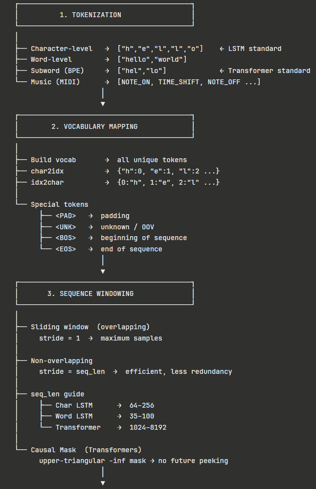
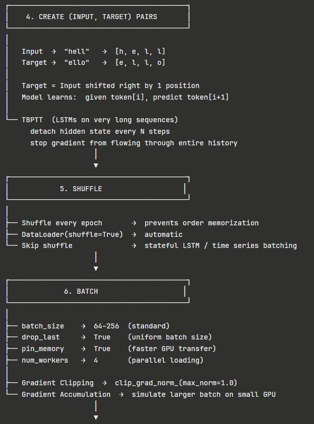
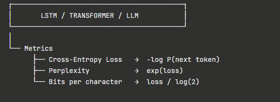

# 🔄 Sequence Modeling — Preprocessing Pipeline

> The model doesn't read text or music.
> It predicts the next token in a sequence.
> Everything between raw data and that prediction is **sequence preprocessing**.

---

## 🔁 Pipeline at a Glance

```
Raw Text / Music Data
   ↓
Tokenization          (split into discrete units)
   ↓
Vocabulary Mapping    (token → integer index)
   ↓
Sequence Windowing    (sliding windows over encoded data)
   ↓
(Input, Target) Pairs (target = input shifted right by 1)
   ↓
Shuffle               (break ordering bias)
   ↓
Batch                 (group for parallel GPU computation)
   ↓
LSTM / Transformer
```

---

## 📂 Structure

| File | Covers |
|---|---|
| `01_tokenization_vocab.md` | Char/word/subword/MIDI tokens, vocab building, special tokens |
| `02_sequence_windowing.md` | Sliding window, input/target pairs, TBPTT, causal mask |
| `03_shuffle_batch.md` | DataLoader, stateful batching, gradient clipping, metrics |

---

## ❓ Why This Matters

| Problem | Caused By |
|---|---|
| Model predicts garbage | No vocabulary mapping — raw strings into model |
| Learns ordering, not patterns | No shuffle — sees same order every epoch |
| Exploding gradients | No gradient clipping — LSTMs are especially vulnerable |
| Model peeks at the future | No causal mask in Transformer |
| Inconsistent batch shapes | No drop_last — final batch is smaller |

---

## ⚡ When to Apply Each Step

| Step | LSTM | Transformer | Music Gen |
|---|---|---|---|
| Char tokenization | ✅ | ⚠️ Subword preferred | ✅ |
| Vocabulary mapping | ✅ | ✅ | ✅ |
| Sliding window | ✅ | ✅ | ✅ |
| TBPTT | ✅ | ❌ | ✅ |
| Causal mask | ❌ | ✅ | ✅ |
| Shuffle | ✅ | ✅ | ✅ |
| Stateful batching | ✅ | ❌ | ✅ |
| Gradient clipping | ✅ | ⚠️ | ✅ |

---

## 🔬 Core Idea

Sequence modeling has one objective:

**Given everything seen so far → predict the next token.**

The entire preprocessing pipeline exists to create that prediction task from raw data — and to deliver it to the model efficiently.

---

*For deep breakdowns, math, and code — refer to the individual files above.*



