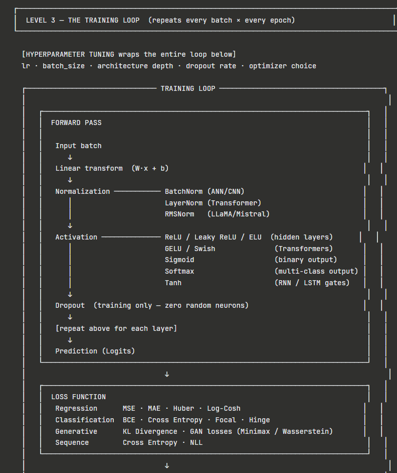
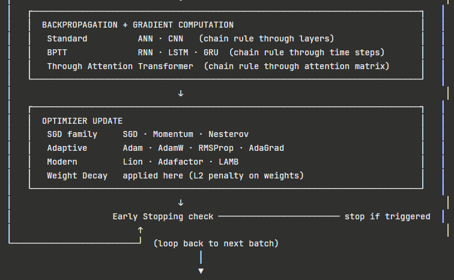
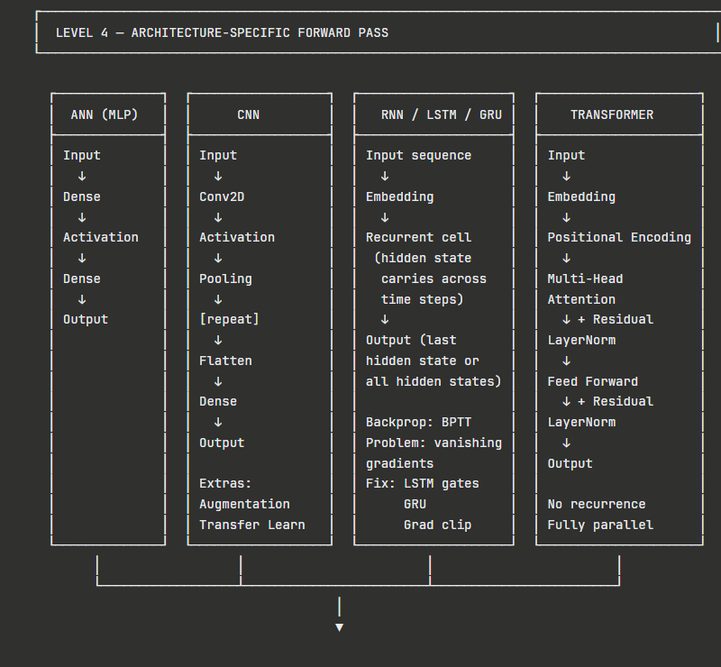
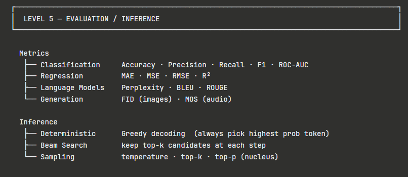
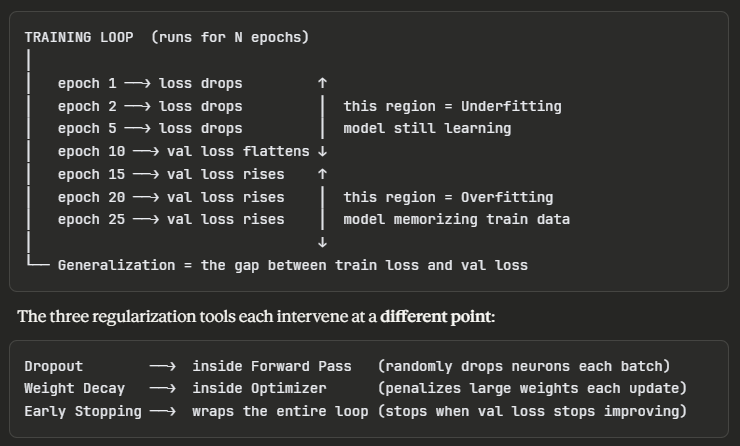

This document summarizes a common deep learning workflow and highlights where model generalization arises.

Overview (top):

1) Data processing

- Goal: convert raw inputs into a clean, consistent representation the model can consume.
- Typical steps: data cleaning, normalization / scaling, tokenization (for text), encoding categorical features, spectrogram or image resizing, and batching/shuffling.
- Why it matters: good preprocessing reduces noise, improves optimization stability, and creates the inductive biases that help models learn meaningful patterns rather than spurious artifacts.

2) Main training loop

- Core steps repeated each epoch or iteration:
	- Forward pass: compute model outputs from inputs.
	- Loss computation: compare predictions to targets to get a scalar loss.
	- Backward pass: compute gradients of the loss w.r.t. parameters.
	- Update: apply an optimizer (SGD, Adam, etc.) to change weights.
	- Monitoring: track train/validation loss and metrics.
- Notes: batch size, learning rate schedules, and optimizer choice strongly affect convergence and final performance.

3) Architecture-specific forward pass

- Although the high-level training loop is the same, the forward computation depends on the architecture:
	- CNNs: convolutional feature extraction followed by pooling / classifiers.
	- RNNs/LSTMs: stepwise recurrence over sequences, hidden-state propagation.
	- Transformers: multi-head self-attention and position-wise feed-forward networks.
- Each architecture encodes different inductive biases (locality, temporal recurrence, global attention) that affect what patterns the model can learn efficiently.

4) Outcome and evaluation

- The model produces predictions; we evaluate using held-out validation/test sets and metrics (accuracy, F1, RMSE, AUC, etc.).
- Additional analyses: calibration, confusion matrices, prediction distributions, and error case inspection.

5) Where does generalization come from?

- Generalization is the model's ability to perform well on unseen data. It arises from multiple interacting factors:
	- Dataset quality and diversity: representative, varied training examples reduce overfitting to idiosyncrasies.
	- Data splits and validation: using separate validation/test sets measures true generalization and guides hyperparameter choices.
	- Regularization techniques: weight decay, dropout, batch normalization, and data augmentation reduce model variance.
	- Model capacity and architecture: too large a model can overfit; the right inductive bias (architecture) helps learn general patterns.
	- Optimization dynamics: stochastic optimization, learning-rate schedules, and early stopping act as implicit regularizers.
	- Ensembling and transfer learning: ensembles average errors; transfer learning leverages prior knowledge for better generalization with less data.

- In short: preprocessing, training procedure, model design, and evaluation protocol together determine whether a model generalizes beyond its training set.
